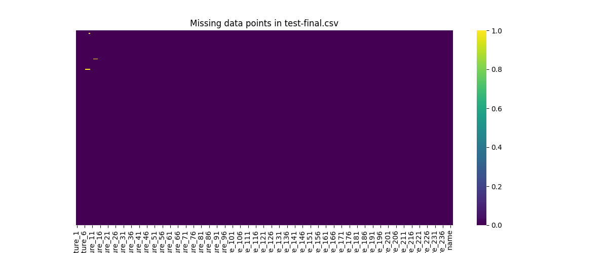

# Stage 1 - Data Preprocessing & Visualization

by Magnus H

---

## A short Background

This task is focusing on Gesture Analysis. We were working with implementing a method for analyzing human gestures, these were recorded using Microsoft
Kinect. Microsoft Kinect aids in producing a 3D skeleton of the body with 20 joints, providing a comprehensive datasetfor analysis.

## Introduction

This report details the processes assigned under stage 1. This is includes tasks undertaken to handle missing values, preprocess the data, and visualize data from the datasets "train-final.csv" and "test-final.csv.".

---

## Processing the Datasets

### Loading the Datasets

When examine the raw "train-final.csv" and "test-final.csv." files, we can see they are missing their headers and there are 240+ unnamed "attributes". To tackle this problem, we automatically gave every attribute a name, except the two last
ones, which we knew were 'gesture name' and 'gesture ID'.

- **Code for loading the csv files**:

```python
def load_data(filepath: str) -> pd.DataFrame:
    feature_names = [f"feature_{i}" for i in range(1, 243)]  # 242 feature columns
    data = pd.read_csv(filepath, header=None, names=feature_names)
    data.rename(columns={
        data.columns[-2]: 'gesture name',
        data.columns[-1]: 'gesture ID'
    }, inplace=True)
    return data

```

### Checking data integrity

In order to check the integrity of the datasets, we began by searching for any missing data points. Two approaches were used for this task. First, we used the check_missing_values(_input: pd.DataFrame) function to identify and to print out
features with missing data. Following this, a visualization step was undertaken in which a heatmap was created. Heatmaps can provide a better and clearer visual representation of the missing data points in the datasets.

- **Code handling missing values**:

```python
import pandas as pd


def check_missing_values(_input: pd.DataFrame):
    missing_values = _input.isnull().sum()
    columns_with_missing_values = missing_values[missing_values > 0]
    print("Missing values")
    print(columns_with_missing_values)
```

The following missing data points were found in the datasets:

- **Missing Values in train-final.csv:**

| Feature    | Count |
|------------|-------|
| feature_8  | 4     |
| feature_9  | 4     |
| feature_10 | 4     |
| feature_15 | 3     |
| feature_16 | 3     |
| feature_17 | 3     |

- **Missing Values in test-final.csv:**

| Feature    | Count |
|------------|-------|
| feature_7  | 3     |
| feature_8  | 3     |
| feature_9  | 6     |
| feature_12 | 2     |
| feature_13 | 2     |
| feature_14 | 2     |

As the tables suggest, it doesn't seem to be that numerous, but we are missing the context of the entire dataset.

#### Heatmap over dataset

To get an idea how much of data were missing, a heatmap were created.

- **Code Generate heatmap**:

```python
import seaborn as sns
import pandas as pd


def print_heatmap(_input: pd.DataFrame, _name: str):
    plt.figure(figsize=(12, 5))
    sns.heatmap(_input.isnull(), cmap='viridis', cbar=True, yticklabels=False)
    plt.title(_name)
    plt.show()
```

The `print_heatmap(_input: pd.DataFrame, _name: str)` takes a DataFrame and creates heatmap plot, showing the missing data points. This procedure gave the following heatmaps. The small yellow lines in the plot indicating the locations of missing data.


Below shows the missing datapoints on the test-final.csv file.

Both heatmaps showed that not too many data points are actually missing and this open ups for different solutions to keep the integrity of the datasets.

### 3 Handling Missing Values

Missing values are now identified and quantified, the next step is to handle this issue. In both the datasets, missing spots are filled with the average of each column, a method that helps in maintaining the integrity of the dataset and avoid data
loss when deleting the rows, as for the amount of missing data points is not that great and the solution will not have a major impact no mather what.

- **Code line for filling out the missing data points**:

```python
  .fillna(X.mean(), inplace=True)
```

---

### Getting to know the data better

Trying to visualize a dataset with 200+ features can be quite challenging and also somewhat impractical, not only that, important details might be lost. An alternative approach was used by employing box plots to observe the distribution and
variability of each feature.

#### Boxplots

The following code were implemented, to be able to get an idea what we are dealing with.

- **Plotbox method**:

```python
 def plot_boxplot(_input: pd.DataFrame, _name: str):
    _input.boxplot(figsize=(12, 8))
    plt.xticks(rotation=90)  # Rotate x labels
    plt.title(_name)
    plt.show()
 ```

Please note the strange distribution of the first 60 features.


Below shows Fig 4. of the test-final.csv dataset, and it also shows some screwedness in the features.


Inspecting Fig 3 and 4, it shows that the first 60 features appear to be skewed in some manner, which could potentially have a negative impact on the model later on. Furthermore, four distinct parts can be identified in the dataset: positions_data, cosine_angles_data, mean_positions_data, and std_positions_data.

Now we examine the labels (Gesture_ID) classes of both the datasets to get an idea if we are dealing with some imbalance of the classes in the training vs testing dataset. This could be an issue because the models can preform well on one dataset but poorly on another.


Looking at the histograms it appears theres some imbalance between the training and testing classes as the model trains more for instance on gesture ID 7 (25 times), but only tests like for 10 for the same gesture and so on.

## Pre-processing Attribute Values

Given that some attributes are rather screwed, that might affect the modeling later on in the process, something should be done, a normalization was decided to be done over the datasets to mitigate this.

- **Normalization method**:

```python
    scaler = StandardScaler()
X_normalized_training = scaler.fit_transform(X_training)
X_normalized_testing = scaler.fit_transform(X_test)
# Make it into a dataframe
X_normalized_training_df = pd.DataFrame(X_normalized_training, columns=X_training.columns)
X_normalized_testing_df = pd.DataFrame(X_normalized_testing, columns=X_training.columns)
 ```

## A second visualization

Another visualisation were done after the preprocess, to estimate the changes done to the datasets.


Below shows the normalized of the testing data set.


The plots now shows a uniform scale, yey some clear outliers are clearly visible within the cosine part of the dataset.

---

## 5. Conclusion

In this stage 1 report, the integrity of datasets used for Gesture Analysis was examined. Missing values, can be a potential pitfall in the analysis, thereby these were handled by filled out  with the average of each column, trying to maintaining the dataset’s structure and eliminating any possible data gaps.

Furthermore, to ensure uniformity and comparability, _Z-score normalization_ was applied, mitigating feature skewness and standardizing the data. To verify the efficacy of these preprocessing steps plots were done to get insight into the
transformed data, heatmaps and boxplots were utilized as well. Heatmaps displayed the initially missing data points, while boxplots provided a view of each feature’s distribution, confirming the normalization process were done correctly.
This approach will ensure a foundation for the implementation of gesture analysis models.

---
